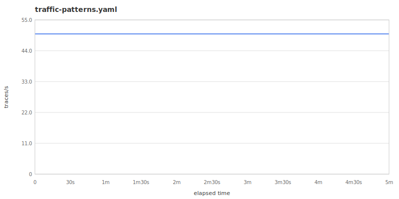
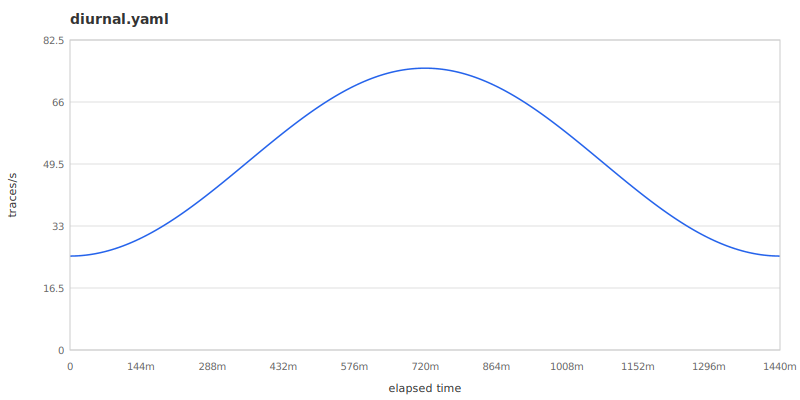
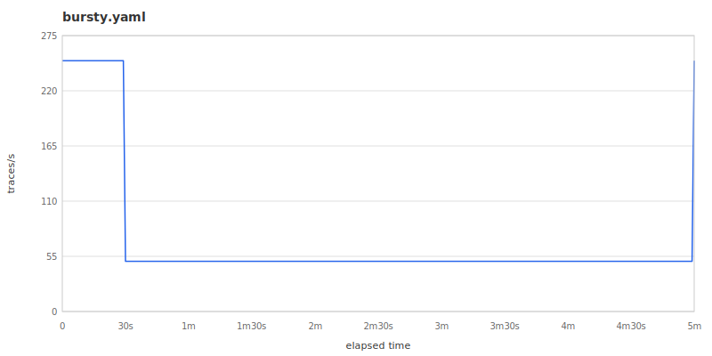

# motel: Preview Traffic

*2026-02-22T09:00:00Z*

motel preview renders the effective traffic rate over time as an SVG chart. This is useful for verifying bursty patterns, scenario overrides, and ramp-up shapes before sending traffic to a collector.

## Uniform traffic

A flat rate produces a horizontal line across the chart.

```bash
motel preview --duration 5m docs/examples/traffic-patterns.yaml -o /tmp/uniform.svg
file /tmp/uniform.svg | grep -c 'SVG'
```

```output
1
```



## Diurnal traffic

A sine wave oscillating between trough (0.5x) and peak (1.5x) over a 24-hour period. The preview shows the full cycle.

```bash
cat > /tmp/diurnal.yaml << 'EOF'
version: 1
services:
  api:
    operations:
      request:
        duration: 10ms +/- 3ms
        calls:
          - database.query
  database:
    operations:
      query:
        duration: 5ms +/- 2ms
traffic:
  rate: 50/s
  pattern: diurnal
EOF
motel preview --duration 24h /tmp/diurnal.yaml -o /tmp/diurnal.svg
file /tmp/diurnal.svg | grep -c 'SVG'
```

```output
1
```



## Bursty traffic

Alternates between a base rate and periodic high-rate bursts. This example bursts to 5x every minute for 10 seconds.

```bash
cat > /tmp/bursty.yaml << 'EOF'
version: 1
services:
  api:
    operations:
      request:
        duration: 10ms +/- 3ms
        calls:
          - database.query
  database:
    operations:
      query:
        duration: 5ms +/- 2ms
traffic:
  rate: 50/s
  pattern: bursty
  burst_interval: 1m
  burst_duration: 10s
EOF
motel preview --duration 5m /tmp/bursty.yaml -o /tmp/bursty.svg
file /tmp/bursty.svg | grep -c 'SVG'
```

```output
1
```



## Bursty traffic with scenario overrides

The stress-test topology combines a bursty base pattern (500/s with 10x bursts) with two scenario overrides: a sustained peak at 5,000/s and an extreme burst at 1,000/s with 15x multiplier. Scenario windows appear as shaded rectangles.

```bash
motel preview --duration 3m docs/examples/stress-test.yaml -o /tmp/stress-test.svg
grep 'class="scenario-rect"' /tmp/stress-test.svg | wc -l | tr -d ' '
```

```output
2
```


## Inferred duration

Without `--duration`, motel infers a preview window from the topology's scenarios — the latest scenario end time plus a 10% buffer. Without scenarios, it defaults to 5 minutes.

```bash
motel preview docs/examples/stress-test.yaml -o /tmp/inferred.svg
head -1 /tmp/inferred.svg | grep -c '<svg'
```

```output
1
```

## Output options

Write to a file with `-o`, or pipe stdout to a file or viewer.

```bash
motel preview --duration 1m docs/examples/traffic-patterns.yaml | head -1 | grep -c '<svg'
```

```output
1
```

The SVG is self-contained with inline styles and no external fonts. It renders on GitHub, in browsers, and in most image viewers.
