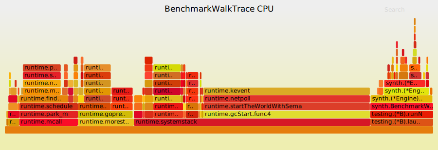

# Performance profile

Profiling results from motel's engine benchmarks on an Apple M1 (8-core, 16GB).
Run with Go 1.25 and the OTel Go SDK v1.40.

## Throughput ceiling

The engine's throughput is primarily controlled by the inter-arrival sleep in
the main loop, not by CPU. However, trace generation time is additive to the
sleep interval, so the effective rate is lower than the target — particularly
at high rates where the per-trace generation time becomes a significant
fraction of the interval:

| Target rate | Actual spans/sec | Spans per run (1s) | Allocs/run |
|-------------|------------------|--------------------|------------|
| 100/s       | 363              | 364                | 5,209      |
| 1,000/s     | 3,440            | 3,443              | 49,080     |
| 5,000/s     | 16,470           | 16,475             | 234,120    |
| 10,000/s    | 32,070           | 32,077             | 457,120    |

The test topology produces ~3.6 spans per trace (gateway, backend, database,
cache). At 10,000 traces/s the engine produces ~32,000 spans/s with a noop
exporter rather than the theoretical ~36,000, because each ~4 us trace
generation eats into the 100 us inter-arrival interval. This is still well
above the rate at which most collectors start dropping data, so motel is not
the bottleneck at any rate in the stress-test guide.

## Per-span cost

From `BenchmarkWalkTrace` with a 4-service topology (4 spans/trace):

- **~3,900 ns/trace** (~975 ns/span)
- **6,112 bytes/trace** (~1,528 bytes/span)
- **54 allocs/trace** (~13.5 allocs/span)

Most allocation comes from the OTel SDK, not from motel's engine code:

| Source                         | Share of alloc_space |
|--------------------------------|----------------------|
| OTel `newRecordingSpan`        | 40%                  |
| OTel `SetAttributes` (slice grow) | 27%              |
| motel `walkTrace` (attr slices, maps) | 24%          |
| OTel span options              | 9%                   |

## CPU hot paths

From a CPU profile of `BenchmarkWalkTrace` (4-service topology, noop exporter):



The flamegraph shows `walkTrace` and `executeCall` as the widest application
frames, with the OTel SDK (`(*tracer).Start`, `newRecordingSpan`,
`SetAttributes`) underneath. Runtime and GC are visible but modest.

To reproduce this flamegraph:

```sh
go test -run=NONE -bench=BenchmarkWalkTrace -benchtime=5s \
  -cpuprofile=cpu.prof ./pkg/synth/
go tool pprof -raw cpu.prof | stackcollapse-go.pl | flamegraph.pl > flamegraph.svg
```

Sample `pprof -text` output from the same profile:

```
      flat  flat%   sum%        cum   cum%
     0.24s  2.11% 46.52%         4s 35.24%  synth.(*Engine).walkTrace
     0.03s  0.26% 46.78%      2.91s 25.64%  synth.(*Engine).executeCall
     0.05s  0.44% 47.22%      1.76s 15.51%  sdk/trace.(*tracer).Start
     0.25s  2.20% 49.43%      1.15s 10.13%  sdk/trace.(*tracer).newSpan
     0.17s  1.50% 54.01%      0.67s  5.90%  sdk/trace.(*recordingSpan).SetAttributes
```

The engine's own logic (`walkTrace` + `executeCall`) accounts for about 60% of
CPU, with the OTel SDK taking the remaining 40%. GC pressure is modest at ~5%.

## stdout vs OTLP export

Benchmark allocations at 1,000 traces/s for 1 second (noop exporter vs stdout
writing to `io.Discard`):

| Exporter        | Spans/sec | Allocs/run | Bytes/run |
|-----------------|-----------|------------|-----------|
| noop            | 3,456     | 49,270     | 5.5 MB    |
| stdout (discard)| 3,130     | 187,640    | 13.4 MB   |

stdout serialisation adds ~3.8x more allocations and ~2.4x more memory per run.

## CPU usage

Measured with `/usr/bin/time` on the real binary over a 10-second run with a
4-service topology. CPU percentage is user+sys time divided by wall time,
representing usage of a single core:

| Target rate | stdout CPU | OTLP CPU |
|-------------|-----------|----------|
| 1,000/s     | 14%       | 6%       |
| 5,000/s     | 28%       | 13%      |
| 10,000/s    | 39%       | 20%      |

OTLP export (to a local collector with a noop exporter) uses roughly half the
CPU of stdout, because the OTel SDK batches spans and the collector handles
serialisation.

## When does motel fall behind?

With OTLP export, motel keeps pace at all tested rates up to 10,000 traces/s.

With `--stdout`, the synchronous JSON serialisation becomes a bottleneck at
high rates. At a target of 10,000 traces/s, the stdout exporter achieves only
~5,900 traces/s (~23,500 spans/s). For rates above ~5,000 traces/s, use OTLP
export instead.

If you see interval drift (actual rate lower than target), check:

1. Whether you're using `--stdout` — switch to OTLP for high rates
2. Collector queue depth and retry backoff
3. Network latency if sending OTLP to a remote endpoint

## Profiling a live run

motel includes a `--pprof` flag that starts a pprof HTTP server:

```sh
motel run --pprof :6060 --stdout --duration 30s your-topology.yaml > /dev/null
```

Then in another terminal:

```sh
# CPU profile (30-second sample)
go tool pprof 'http://localhost:6060/debug/pprof/profile?seconds=30'

# Heap profile
go tool pprof http://localhost:6060/debug/pprof/heap

# Goroutine dump
curl 'http://localhost:6060/debug/pprof/goroutine?debug=2'
```

## Recommendations

- For collector stress testing, 5,000-10,000 traces/s is safe with OTLP
  export. At 10,000 traces/s motel uses ~20% of one core, leaving ample
  headroom
- `--stdout` tops out at ~5,000-6,000 traces/s. Use it for debugging and
  small-scale testing. For sustained high-rate runs, use OTLP export
- The per-span allocation cost (~1.5 KB, 13 allocs) is dominated by the OTel
  SDK. Reducing motel's own allocations would yield diminishing returns
- If profiling a specific topology, use `--pprof :6060` and `go tool pprof`
  to identify whether the bottleneck is motel, the exporter, or the collector
