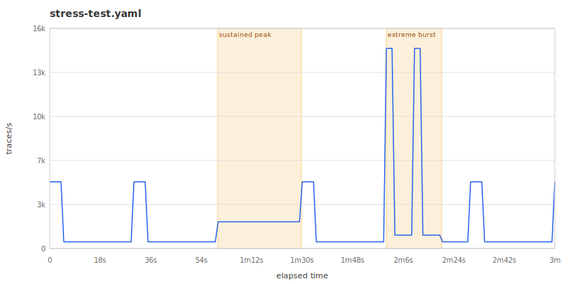

# Stress-Test Collector Queue and Retry Configuration

This guide shows how to use motel to push a collector to its limits — finding queue overflow thresholds, verifying retry behaviour, and measuring data loss under load.

## Prerequisites

- A running OpenTelemetry Collector with persistent queue and retry settings you want to test
- A backend (Jaeger, Tempo, or similar) to receive traces from the collector
- motel installed

## 1. Start with a baseline

Before stressing anything, establish a baseline at a comfortable rate. This confirms your pipeline works end-to-end:

```sh
motel run --endpoint http://localhost:4318 --protocol http/protobuf \
  --duration 30s docs/examples/stress-test.yaml
```

Check that traces flow through the collector to your backend. If they do not arrive at low volume, fix the pipeline before increasing load.

## 2. Use bursty traffic to test queue overflow

Bursty traffic sends a steady rate most of the time, then spikes periodically. This is the pattern that most commonly triggers queue overflow — sustained high throughput is easier to size for than sudden spikes.

The example topology at `docs/examples/stress-test.yaml` uses these traffic settings:

```yaml
traffic:
  rate: 500/s
  pattern: bursty
  burst_multiplier: 10
  burst_interval: 30s
  burst_duration: 5s
```

This sends 500 traces/s normally, spiking to 5,000 traces/s for 5 seconds every 30 seconds. Each trace produces multiple spans (one per operation in the call graph), so the actual span rate is several times higher.

To visualise the traffic shape before sending it, use `motel preview`:

```sh
motel preview --duration 3m docs/examples/stress-test.yaml -o traffic.svg
```



Run it for long enough to see multiple burst cycles:

```sh
motel run --endpoint http://localhost:4318 --protocol http/protobuf \
  --duration 5m docs/examples/stress-test.yaml
```

Watch the collector's own metrics during the run. Key signals:

- `otelcol_exporter_queue_size` — current queue depth
- `otelcol_exporter_queue_capacity` — configured maximum
- `otelcol_exporter_enqueue_failed_spans` — spans dropped because the queue was full

If the queue never fills, increase `burst_multiplier` or `burst_duration`.

## 3. Ramp up to find the throughput ceiling

Use scenarios to progressively increase the rate and find where the collector starts dropping data:

```yaml
scenarios:
  - name: sustained peak
    at: +1m
    duration: 30s
    traffic:
      rate: 5000/s
      pattern: uniform
```

Alternatively, use custom traffic with segments for a manual ramp:

```yaml
traffic:
  rate: 100/s
  pattern: custom
  segments:
    - rate: 500/s
      until: 1m
    - rate: 2000/s
      until: 2m
    - rate: 5000/s
      until: 3m
    - rate: 10000/s
      until: 4m
```

Run it and note the rate at which `otelcol_exporter_enqueue_failed_spans` begins climbing. That is your collector's effective ceiling for this configuration.

## 4. Verify retry behaviour

To test retries specifically, make the backend intermittently unavailable while motel is running. For example, if your backend is behind a proxy, briefly block traffic:

```sh
# In one terminal — generate load
motel run --endpoint http://localhost:4318 --protocol http/protobuf \
  --duration 5m docs/examples/stress-test.yaml

# In another terminal — simulate backend outage after 30 seconds
sleep 30 && docker stop tempo && sleep 15 && docker start tempo
```

During the outage, the collector should queue spans and retry. After the backend returns, check:

- `otelcol_exporter_send_failed_spans` — spans that failed export (should spike during outage)
- `otelcol_receiver_refused_spans` — spans the collector could not accept
- Queue size should drain back to zero after the outage ends

If the queue fills and spans are dropped during a 15-second outage, your queue size or retry settings need tuning.

## 5. Measure data loss

Compare what motel sent against what your backend received. Motel logs the total number of spans it generates:

```sh
motel run --endpoint http://localhost:4318 --protocol http/protobuf \
  --duration 2m docs/examples/stress-test.yaml 2>&1 | grep spans
```

Then query your backend for the same time window and count the spans received. The difference is your data loss under that load profile.

For precise counting, send traces to both the collector and stdout simultaneously using two collector receivers, then compare line counts:

```sh
motel run --stdout --duration 2m docs/examples/stress-test.yaml | wc -l
```

This gives you the exact number of spans motel produced. Compare against your backend's span count for the same period.

## Tips

- **Start low, increase gradually.** It is easier to find the breaking point by ramping up than by guessing a high number.
- **Monitor the collector, not just the backend.** Queue depth and enqueue failures tell you what is happening before data loss shows up downstream.
- **Test with realistic topologies.** A single flat service produces uniform spans. Real systems have variable fan-out and latency, which affects batching efficiency. Use a topology that matches your production call graph.
- **Run long enough.** Short runs may not trigger queue overflow if the burst fits within available headroom. Run for at least 5 minutes with multiple burst cycles.
- **Check both protocols.** gRPC and HTTP/protobuf have different performance characteristics. Test whichever your production agents use:
  ```sh
  motel run --endpoint http://localhost:4317 --protocol grpc ...
  motel run --endpoint http://localhost:4318 --protocol http/protobuf ...
  ```

## Further reading

- [Example topology: stress-test.yaml](../examples/stress-test.yaml) — the topology used in this guide
- [Performance profile](../explanation/performance-profile.md) — motel's own throughput ceiling and per-span cost
- [CLI reference](../reference/synth.md) — all CLI flags and output formats
